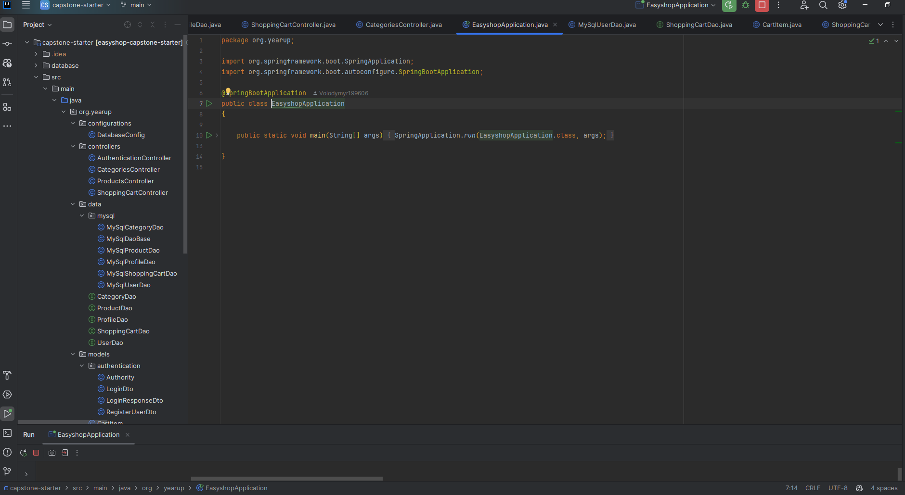
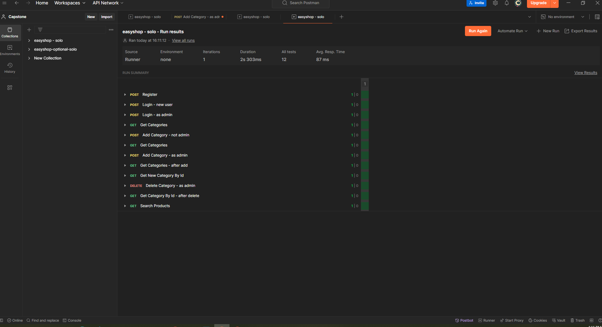

# EasyShoP Project

### The website uses Spring Boot API project for backend server, with my SQL database for data storage.

⚙️

### Since my code changes are all in the API project, I needed to rely heavily on Postman to test my Application endpoints and logic.

⚙️

However, a front-end website project is also avaliable in my starter code, so in that case I can test my work, and see how my API

is used on the web.

⚙️

### This website allows users to browse products in various categories, add them to a shopping cart and check out to order the products. All of the features of the UI are fully functional.

⚙️

First user Log in and then can browse products in various categories using filter

⚙️

⚙️

Choosing color of the items and changing price

⚙️

#### The changes and development was needed to be done in the backend Spring Boot API project.

⚙️

The existing API code includes: user registration and login, the ability to display products by category, search for or filter the products list. The current API code was functioanl, but there was a few bugs in the current project.

### The search/filter functionality had some bugs and returned inncorect search results. I tested different search and filter criteria to find and fix those bugs. Bug 1 Users have reported that the product search functionality is returning incorrect results.I was needed to test the search logic to find and fix the bugs. Bug 2 was Some users have also noticed that some of the products seem to be duplicated. Laptop was listed 3 times and it appears to be the same product, but there where slight differences, such as the description and price. I was needed to find and fix that bug, so that administrators can safely update products.

🐛

