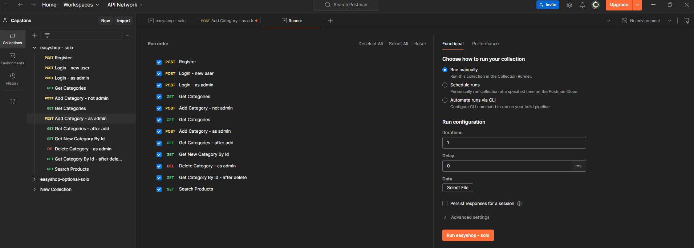
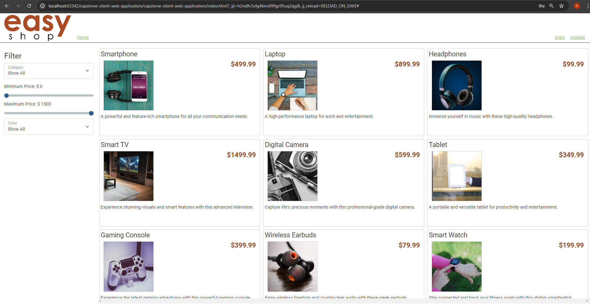
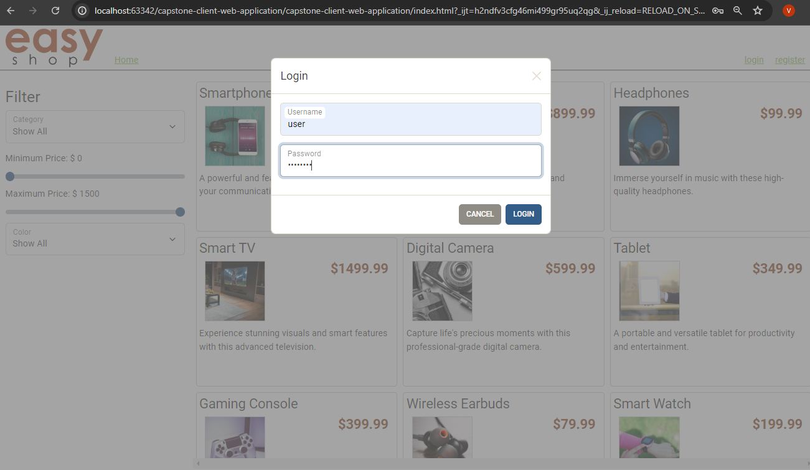
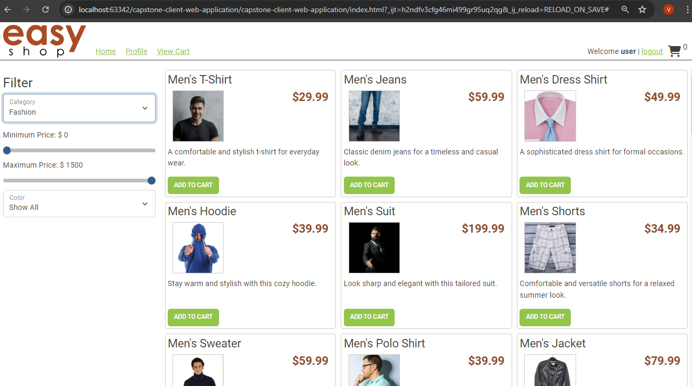
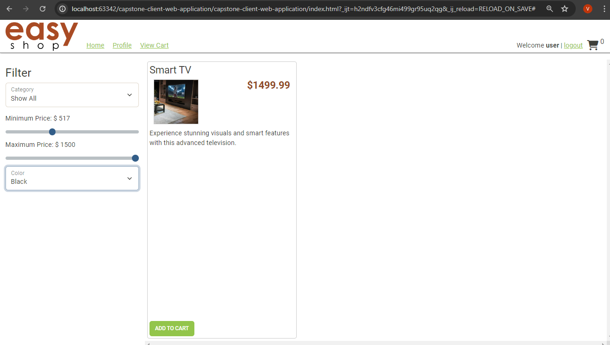

# EasyShoP Project

### The website uses Spring Boot API project for backend server, with my SQL database for data storage.

⚙️

### Since my code changes are all in the API project, I needed to rely heavily on Postman to test my Application endpoints and logic.

⚙️

However, a front-end website project is also avaliable in my starter code, so in that case I can test my work, and see how my API

is used on the web.

⚙️

### This website allows users to browse products in various categories, add them to a shopping cart and check out to order the products. All of the features of the UI are fully functional.

⚙️

First user Log in and then can browse products in various categories using filter

⚙️

⚙️

Choosing color of the items and changing price

⚙️
